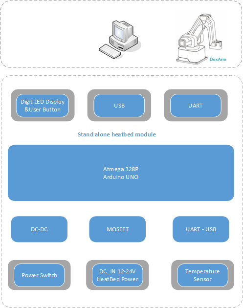
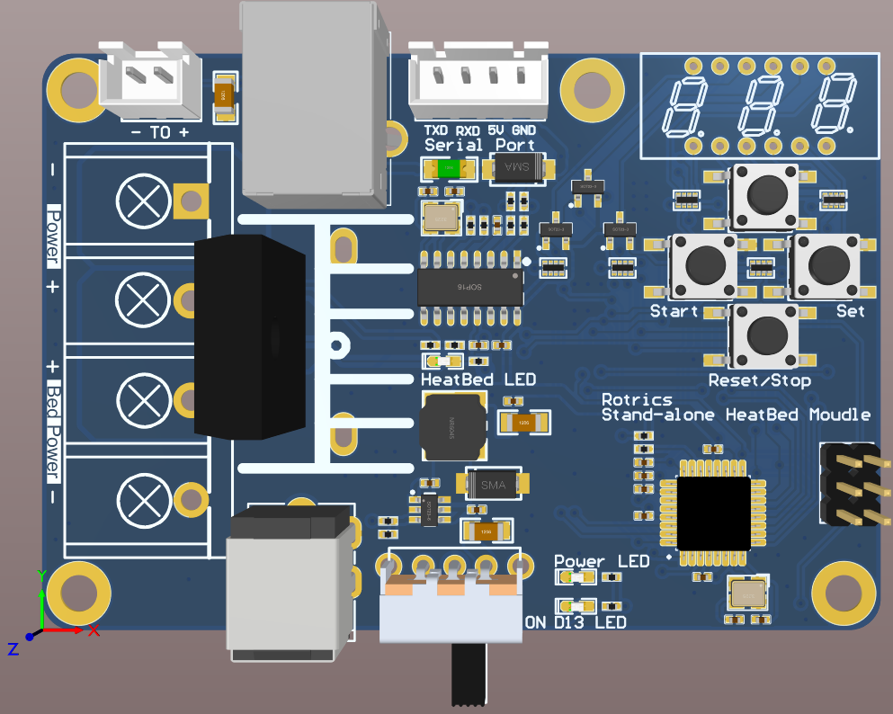
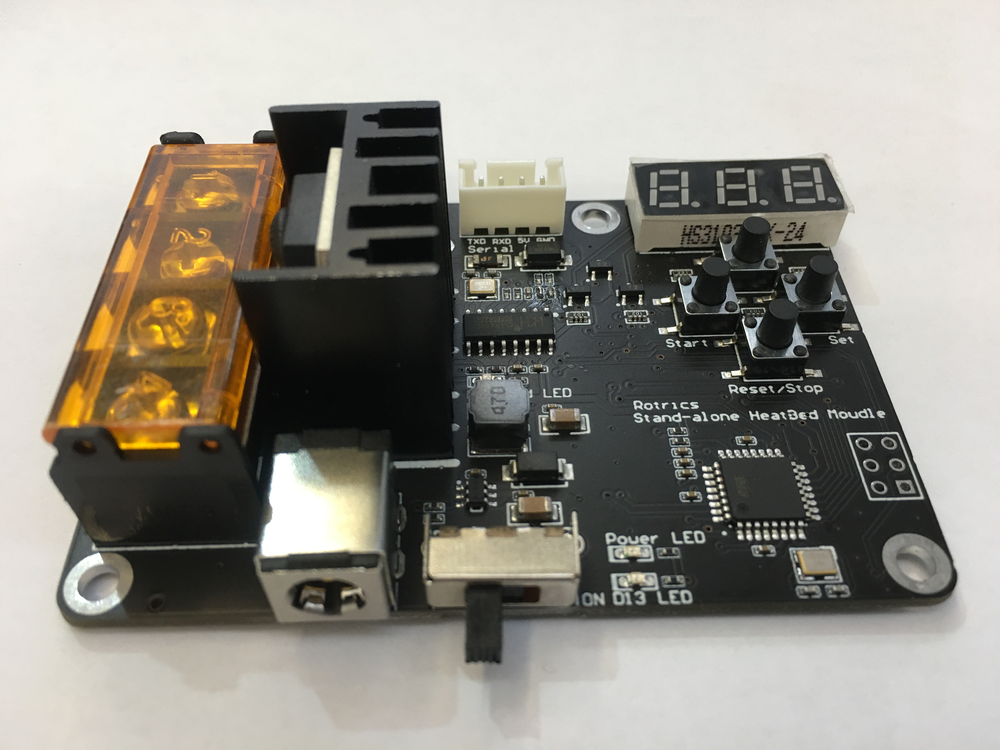
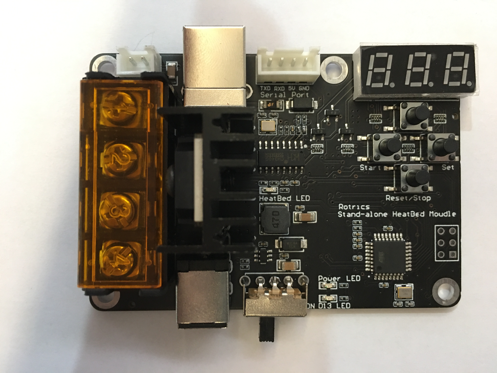

# Stand-alone heatbed module

# Overview
Shand-alone heatbed module for DexArm or any 3D printer. The heating temperature can be set through the buttons, serial port or USB on the module.

- HeatBed Power 12-24V, 10-15A
- MOSFET HA210N06, 4mΩ@VGS=10V 210A/60V
- DC_IN 12-24V, 10-15A
- DC-DC 5V, HT7463A
- Arudino UNO(ATMEGA328P)
- Digit LED Display & User Button, setting heating temperature like soldering station
- UART-USB, CH340, support PC set heating temperature

The block diagram below presents main components of the Stand-alone heatbed module and interconnections between components.

!Note: This is the init version of the definition, the final function parameters please refer to the purchase introduction.

# PCB
## 3D PCB

## PCB1

## PCB2

